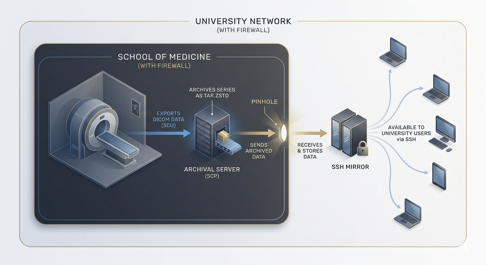

# DICOM Receiver & Archiver

Automated DICOM reception with PatientID-based sorting and Zstd compression.
Receives studies via `storescp`, then compresses them into `.tar.zst` archives
organised by PatientID under your home directory.



## Prerequisites

| Requirement | macOS | Linux (Debian/Ubuntu) |
|---|---|---|
| DCMTK | `brew install dcmtk` | `sudo apt install dcmtk` |
| Python 3 | ships with macOS | `sudo apt install python3 python3-venv` |


## Installation

### Step 1 — Get the project

Clone or download the repository, then `cd` into its root. The rest of this
README assumes commands run from the project root (the directory containing
`scripts/` and `DICOMs/`).

### Step 2 — Create a Python virtual environment

A virtual environment (venv) solves the "wrong pip / wrong python" problem entirely.
Inside a venv, `python` and `pip` are always the *same* interpreter, and
`which python` gives you the exact path you need for the shell script.

```bash
# Create the venv next to the scripts folder (one-time setup)
python3 -m venv ./venv
```

> **Why `python3 -m venv`?**  
> Running `python3 -m venv` uses whichever `python3` is on your PATH to create
> the environment, so you always know which interpreter owns it. Once activated,
> every `pip install` and every `python` call inside that shell session goes to
> the same interpreter — no mismatch possible.

### Step 3 — Activate the venv and install dependencies

```bash
# Activate (do this once per terminal session)
source ./venv/bin/activate

# Your prompt will now show (venv) to confirm it is active.
# Install dependencies — pip here is guaranteed to match python
pip install -r ./scripts/requirements.txt
```

### Step 4 — Auto-configure the shell script

The script needs two absolute paths: the venv's Python and the `storescp`
binary. Both vary by machine — Homebrew on Apple Silicon puts binaries in
`/opt/homebrew/bin/` rather than `/usr/local/bin/`; Linux differs again.
Run both `sed` commands to set them automatically:

```bash
# Capture paths into variables first (avoids nested quote issues)
PYTHON_PATH=$(./venv/bin/python3 -c 'import sys; print(sys.executable)')
STORES_PATH=$(which storescp)

# Optional: confirm the values look correct before patching
echo "Python: $PYTHON_PATH"
echo "storescp: $STORES_PATH"

# Patch the script
sed -i.bak "s|PYTHON_BIN=.*|PYTHON_BIN=\"$PYTHON_PATH\"|" ./scripts/start_storescp.sh
sed -i.bak "s|STORES_BIN=.*|STORES_BIN=\"$STORES_PATH\"|" ./scripts/start_storescp.sh
```

Verify both were set correctly:

```bash
grep -E "PYTHON_BIN|STORES_BIN" ./scripts/start_storescp.sh
# Expected output (paths will differ by machine):
# STORES_BIN="/opt/homebrew/bin/storescp"    # macOS Apple Silicon
# STORES_BIN="/usr/local/bin/storescp"        # macOS Intel
# STORES_BIN="/usr/bin/storescp"              # Linux
# PYTHON_BIN="/Users/alice/dicom-archiver/venv/bin/python3"
```

If `which storescp` returns nothing, DCMTK is not installed — go back to Step 1.

> **Why `sys.executable` instead of `which python`?**  
> `which` depends on whether the venv is activated in the current shell.
> Asking the venv's Python to report `sys.executable` works regardless of
> activation state and is guaranteed to return the correct path.
>
> **Why `-i.bak`?**  
> macOS (BSD sed) and Linux (GNU sed) handle in-place editing slightly
> differently. The `.bak` suffix satisfies both. The resulting
> `start_storescp.sh.bak` is gitignored.
>
> After this step the script is fully self-contained. You do **not** need to
> activate the venv before running it — all paths are absolute.

### Step 5 — Set permissions

```bash
chmod +x ./scripts/*.sh ./scripts/*.py
```

### Step 6 — Copy scripts to a system-wide location

```bash
sudo cp ./scripts/start_storescp.sh /usr/local/bin/
sudo cp ./scripts/archive_study.py  /usr/local/bin/
```

### Step 7 — Auto-start on reboot (cron)

```bash
(crontab -l 2>/dev/null; echo "@reboot /bin/bash /usr/local/bin/start_storescp.sh") | crontab -
```

Verify the entry was added:

```bash
crontab -l
```

## macOS-specific: Full Disk Access

macOS blocks background processes from writing to your Home folder by default.
Grant access **before** testing:

1. Open **System Settings → Privacy & Security → Full Disk Access**
2. Click **+** and add `/bin/bash`
3. Add `/usr/sbin/cron`
4. Add **Terminal.app** (or whatever terminal emulator you use)


## Testing

**1. Start the receiver manually:**

```bash
/usr/local/bin/start_storescp.sh
```

**2. Send a test study** (from another terminal):

```bash
storescu localhost 11112 -aet SCANNER -aec PY_STORE_SCP ./DICOMs/*.dcm
```

> Don't use `+sd ./DICOMs` here: on macOS Finder leaves `.DS_Store` files in
> the directory and `storescu` aborts trying to parse them. The `*.dcm` glob
> sidesteps that.

**3. Verify output:**

The bundled `DICOMs/MR.dcm` has `PatientID=crlab`. The script falls back to
`~/guest/` whenever `~/<PatientID>/` does not exist locally — so unless you
ran `mkdir ~/crlab` first, the archive lands in `~/guest/`:

```bash
ls -lh ~/guest/                # default landing zone for the bundled demo
ls -lh ~/crlab/                # only if you mkdir'd it first
# expect: 20140310-133834_stc-test_Research-MCBI-TESTING_crlab.tar.zst
# (date and time come from the DICOM tags, not the wall clock)
```


## Archive filename format

Each archive is named:

```
YYYYMMDD-hhmmss_<PatientName>[_<Step>][_<PatientID>].tar.zst
```

| Segment | DICOM tag | Notes |
|---|---|---|
| `YYYYMMDD-hhmmss` | `StudyDate` (0008,0020) + `StudyTime` (0008,0030) | joined by `-` |
| `<PatientName>` | `PatientName` (0010,0010) | defaults to `unknown` if missing |
| `<Step>` | `PerformedProcedureStepDescription` (0040,0254) | omitted when absent |
| `<PatientID>` | `PatientID` (0010,0020) | omitted when absent or path-traversal-rejected |

**Two-tier delimiters.** Items are separated by `_`; within an item, `-` is
the delimiter (so spaces and any literal `_` in DICOM tag values are
remapped to `-`). This keeps the structure unambiguous to parse on `_`
boundaries, even when patient names or step descriptions contain spaces.

**Inside the archive.** Files are at the root of the tar — `tar -xf foo.tar.zst`
extracts directly into the current directory. Earlier versions of the script
wrapped contents in an `st_<timestamp>/` parent dir; archives written
before that change still have the wrapper.


## Optional: preferred network transfer syntax

`storescp` negotiates a transfer syntax with each sender. By default it
prefers uncompressed; you can ask it to prefer something else via the
`PREFER_TS` variable near the top of `start_storescp.sh`:

```bash
# scripts/start_storescp.sh
PREFER_TS="--prefer-lossless"   # default in this repo — JPEG lossless when offered
# PREFER_TS=""                  # storescp default (uncompressed)
# PREFER_TS="--prefer-j2k-lossless"
# PREFER_TS="--prefer-rle"
# PREFER_TS="--accept-all"
```

The sender still has to *offer* the chosen syntax for it to be selected; if
not, `storescp` falls back to the next acceptable presentation context. See
[storescp(1) on the DCMTK site](https://support.dcmtk.org/docs/storescp.html)
for the full list of `--prefer-*` flags.

> **Why default to `--prefer-lossless`?** Modalities that can offer JPEG
> lossless will negotiate it, cutting transfer size and on-disk size before
> our own zstd pass — without altering pixel data. Receivers that can't offer
> it are unaffected.


## Optional: change the local archive root

By default the script writes archives under the running user's home directory
(`Path.home() / <PatientID>` or `… / guest`). Drop a `base_dir` into
`~/.config/dicompress/config.json` to point somewhere else:

```json
{
  "base_dir": "/home"
}
```

With `"base_dir": "/home"`, archives land in `/home/<PatientID>/` (e.g.
`/home/crlab/…`) or `/home/guest/` instead of under `/home/<user>/`. Useful
when a service account like `mradmin` runs the receiver but the per-lab
folders live at the system root. The path must already exist and be writable
by the running user — if it doesn't, the script logs a warning and falls back
to `Path.home()` (rather than silently creating system paths from a typo).
The script does **not** create the root, only the `guest` fallback inside it.

For the running user to write into pre-existing user folders like `/home/crlab/`,
the same setgid trick used for the SSH mirror works locally: `sudo chgrp <admin-group> /home/crlab && sudo chmod 2775 /home/crlab`.

This setting and the `ssh` / `smb` mirror blocks below can all coexist in the
same config file; each block is independently optional.


## Optional: mirror archives to a remote SSH server

Once a `.tar.zst` is written locally, it can be copied to a matching folder on
a remote server (e.g. a NAS or shared workstation). The mirror is **off by
default** — drop a config file in place to enable it. If the config is absent
or the remote is unreachable, local archiving is unaffected.

### How destination resolution works

For `PatientID = jflab`, the script probes a list of candidate roots on the
remote — `/volume1/home`, `/home`, `/Users` — and uses the first one that
contains a folder named `jflab`. If none of them do, it falls back to a
same-named `guest` folder under those roots. This means the same fallback
semantics apply on both sides — the script does **not** create new home
folders, and it does not depend on `getent passwd` (which on Synology returns
`/nonexistent` for the system `guest` account, distinct from `/volume1/home/guest`).

The probe list is hard-coded near the top of `archive_study.py` as
`REMOTE_HOME_ROOTS`; edit it if your server keeps homes elsewhere.

After SCP completes:
- Files in `~guest/` are chmod-ed to `0666` (everyone read/write).
- Files in user folders (`~jflab/`, `~crlab/`, …) are chmod-ed to `0664`
  (group read/write, others read).

### Step 1 — Configure the connection

Create `~/.config/dicompress/config.json` on the machine that runs
`archive_study.py` (the same user that owns the local archives):

```bash
mkdir -p ~/.config/dicompress
cp ./scripts/config.example.json ~/.config/dicompress/config.json
# then edit host / port / user to match your server
```

Example:

```json
{
  "ssh": {
    "host": "192.0.2.0",
    "port": 22,
    "user": "mradmin"
  }
}
```

The configured user should be an administrator on the remote. To remove the
mirror, delete the file (or the `ssh` section).

### Step 2 — Install a passwordless SSH key

`archive_study.py` runs non-interactively (`BatchMode=yes`), so password and
host-key prompts will fail. Push your local public key to the remote once:

```bash
cat ~/.ssh/id_ed25519.pub | ssh mradmin@192.0.2.0 \
  "mkdir -p ~/.ssh && chmod 700 ~/.ssh && cat >> ~/.ssh/authorized_keys && chmod 600 ~/.ssh/authorized_keys"
```

If you don't yet have a key pair, create one with `ssh-keygen -t ed25519`
first. Verify with `ssh -p 22 mradmin@192.0.2.0 true` — it must succeed
without prompting.

### Step 3 — Make user folders writable by the admin

By default, user home folders on the remote are mode `755` and owned by the
user — so the admin account cannot SCP into them. Change the group to
`administrators` and add the setgid bit so files inherit the right group:

```bash
# run on the remote, as the admin user
sudo chgrp administrators ~jflab && sudo chmod 2775 ~jflab
sudo chgrp administrators ~crlab && sudo chmod 2775 ~crlab
# repeat for each lab folder you want to mirror into
```

Verify (note the `s` in the group bits, indicating setgid):

```
drwxrwsr-x  4 crlab  administrators  ...  crlab/
drwxrwsr-x  2 jflab  administrators  ...  jflab/
drwxrwsrwx  2 mradmin users           ...  guest/
```

> On Synology DSM the admin group is named `administrators` (not `administ` —
> that's just how `ls -l` truncates the column). Confirm with `id` or
> `getent group | grep ^admin`.

The `~guest/` folder needs to be world-writable so unknown PatientIDs land
there:

```bash
sudo chmod 2777 ~guest
```


## Optional: mirror archives to an SMB share

An alternative to the SSH mirror above: copy each archive to an SMB / CIFS
share mounted on the receiver. Useful when the mirror target is a Mac /
Windows / domain-managed file server rather than a Linux/NAS box you can SSH
into. **This is the newer of the two mirror options and is currently
experimental** — the SSH mirror above is the proven path for NAS targets.

Both blocks can coexist; both mirrors run for each study if both are
configured. Either one missing is a silent no-op.

The receiver-side mount is managed outside this script (in `/etc/fstab` or
a systemd `.mount` unit), so an unreachable share — network down,
firewall, server offline — never blocks local archiving. The script
just probes whether the mount-point is a live mount before each write
and skips with a log line if it isn't.

### Step 1 — Install `cifs-utils` (one time)

```bash
sudo apt install cifs-utils
```

### Step 2 — Store credentials in a root-only file

```bash
sudo tee /etc/cifs-creds-dicompress >/dev/null <<'EOF'
username=YOUR_AD_USERNAME
password=YOUR_AD_PASSWORD
domain=YOUR_DOMAIN
EOF
sudo chmod 600 /etc/cifs-creds-dicompress
sudo chown root:root /etc/cifs-creds-dicompress
```

`mode 600` keeps the password readable only by `root` — the same trust
model as your SSH private key. The file isn't encrypted, but no
non-root user on the box can read it.

### Step 3 — Add an `/etc/fstab` line

```
//FILESERVER.EXAMPLE.COM/sharename /mnt/dicom-mirror cifs \
    credentials=/etc/cifs-creds-dicompress,uid=<svc-user>,gid=<svc-group>,\
    file_mode=0664,dir_mode=02775,_netdev,nofail,x-systemd.automount,\
    x-systemd.mount-timeout=15s 0 0
```

Key options, in plain language:
- `credentials=…` — points to the file in Step 2.
- `uid=<svc-user>,gid=<svc-group>` — make files appear owned by the
  receiver's service account (`mradmin` in our examples) so the running
  script can read/write the mount-point.
- `file_mode=0664,dir_mode=02775` — POSIX appearance from the Linux side
  (server-side ACLs still rule on the wire). **Both values must have a
  leading zero**: `mount.cifs` warns "not expressed in octal" and silently
  parses bare `2775` as decimal, producing the nonsense permission mask
  `05327` (`--wx-w-rwx`, owner has no read — `ls` returns "Permission
  denied" on a mounted directory).
- `_netdev,nofail` — wait for the network; **never block boot** if the
  share is unreachable.
- `x-systemd.automount,x-systemd.mount-timeout=15s` — let systemd mount
  on-demand the first time something touches the mount-point, retry if
  network blips, and time out after 15s rather than hanging the writer.

```bash
sudo mkdir -p /mnt/dicom-mirror
sudo systemctl daemon-reload
sudo mount /mnt/dicom-mirror
mount | grep dicom-mirror   # confirm it mounted
```

### Step 4 — Add the `smb` block to `~/.config/dicompress/config.json`

```json
{
  "smb": {
    "mount_point": "/mnt/dicom-mirror"
  }
}
```

### How destination resolution works

The SMB mirror **auto-creates a folder per PatientID** — different from the
local and SSH paths, which require admin-managed folders and otherwise
fall through to `guest/`.

- For `PatientID = jflab`, the script writes to `<mount_point>/jflab/`,
  creating the folder on first use. New labs land in their own folder
  automatically.
- Permissions inside: best-effort `chmod 0664` for user folders, `0666` for
  guest (the literal `PatientID == "guest"` case). `cifs` may ignore POSIX
  chmod in favour of server-side ACLs — that's expected; share-level
  access control on the server is what actually governs who can see what.
- New directories inherit the `dir_mode` set at mount time (`02775` with
  setgid), so files written into them get the right group automatically.

The local and SSH mirror paths keep their original behaviour (patient
folder must already exist; otherwise the archive lands in guest). The
asymmetry is deliberate: SMB shares tend to be collaboration surfaces
where it's safer to provision-on-demand; local + SSH targets are typically
per-user home directories where the admin should curate the folder set.

> **Caveat about per-user ownership.** Files written through an SMB mount
> always appear owned by the mount user (the `uid=…` you set in fstab) —
> you cannot make `<mount>/jflab/foo.tar.zst` appear owned by jflab when
> the writer is mradmin. If you need true per-lab ownership, manage access
> with **server-side share or NTFS ACLs** rather than POSIX. Symlink-to-guest
> tricks work over SSH/NFS but are inconsistent across SMB clients
> (Windows in particular).


## Project layout

```
.
├── README.md
├── CLAUDE.md                    # notes for AI assistants working on the repo
├── LICENSE
├── .gitignore                   # ignores venv/, *.bak, .DS_Store
├── schematic.png                # diagram embedded at the top of the README
├── DICOMs/                      # one demo DICOM (PatientID=crlab) for `Testing`
├── docs/
│   └── asustor-mirror.md        # ASUSTOR ADM specifics for the SSH-mirror target
├── venv/                        # created by you in Step 2 (gitignored)
└── scripts/
    ├── requirements.txt         # pydicom, zstandard
    ├── start_storescp.sh        # launches storescp, set PYTHON_BIN here
    ├── archive_study.py         # sorts & compresses each completed study
    └── config.example.json      # template for ~/.config/dicompress/config.json
```


## Deployment notes (service account)

The single-user install above (your own login, your own home directory) is
fine for a workstation. For a shared lab receiver you usually want a
dedicated service account that owns the receiver and writes archives into
pre-existing per-lab folders. Two adjustments:

**1. Service-account venv.** Create the venv inside the service user's home
(no system-wide pip install needed):

```bash
sudo useradd -m -s /bin/bash mradmin   # (or use an existing admin account)
sudo -u mradmin python3 -m venv /home/mradmin/DICOMpress-venv
sudo -u mradmin /home/mradmin/DICOMpress-venv/bin/pip install pydicom zstandard
# then point start_storescp.sh's PYTHON_BIN at /home/mradmin/DICOMpress-venv/bin/python3
```

**2. Auto-start under that account.** Add `@reboot` to the service user's
own crontab (not root's):

```bash
sudo -u mradmin crontab -l 2>/dev/null > /tmp/cron
echo "@reboot /bin/bash /usr/local/bin/start_storescp.sh > /home/mradmin/storescp.log 2>&1" >> /tmp/cron
sudo -u mradmin crontab /tmp/cron && rm /tmp/cron
```

**3. Per-lab folder perms (local).** With `"base_dir": "/home"` in
`config.json`, archives land in `/home/<PatientID>/`. The service account
must be able to write there — same setgid trick as the SSH mirror section,
applied locally:

```bash
sudo chgrp <admin-group> /home/crlab && sudo chmod 2775 /home/crlab
# repeat for each lab; <admin-group> is whatever group mradmin belongs to
```

**4. Mirror target on a NAS.** If the mirror target is an ASUSTOR ADM box,
see [docs/asustor-mirror.md](docs/asustor-mirror.md) — `/etc/init.d/` is
regenerated at every boot on ADM, so any persistent customisation has to go
in `/usr/local/etc/init.d/`. That doc also covers the `/home/<lab>/guest`
bind-mount pattern that makes the shared `guest/` folder visible inside
each lab user's Samba home.

## Troubleshooting

| Symptom | Likely cause | Fix |
|---|---|---|
| `ModuleNotFoundError: pydicom` | Script using wrong Python | Confirm `PYTHON_BIN` in `start_storescp.sh` points to the venv |
| `Permission denied` writing to home dir | macOS Full Disk Access | See macOS section above |
| `storescp: command not found` | DCMTK not installed or not on PATH | Reinstall DCMTK; confirm with `which storescp` |
| cron job doesn't run | cron daemon not running | macOS: `sudo cron` is started on demand. Linux: `systemctl status cron` |
| Archive lands in `~/guest/` despite a matching local user folder | `~/<PatientID>/` doesn't exist or wasn't readable when the script ran | Confirm the folder exists; on macOS check Full Disk Access. (Falling through to `~/guest/` is *expected* when no matching folder exists — see the Testing section.) |
| `SSH mirror: could not resolve remote directory …` | Host unreachable, key not installed, or no folder named `<PatientID>` or `guest` under any of `REMOTE_HOME_ROOTS` | Test with `ssh -o BatchMode=yes -p <port> <user>@<host> true`; (re)install pubkey per the SSH section; check `/volume1/home`, `/home`, `/Users` for the expected folder |
| `SSH mirror: scp failed; skipping chmod.` | Network blip, or admin lacks write access to the resolved folder | Re-run the `chgrp administrators && chmod 2775` step on that folder |
| Mirror lands in `~guest/` despite a matching user folder on the remote | The folder lives under a root not in `REMOTE_HOME_ROOTS` | Edit the `REMOTE_HOME_ROOTS` tuple near the top of `archive_study.py` |
| `scp: Permission denied` to a user folder | Folder still owned by user with mode 755 | Run the `chgrp administrators` + `chmod 2775` commands on that folder |
| Studies stop archiving and pile up in `/tmp/dicom_incoming/` | `config.json` is malformed; `archive_study.py` logs `Warning: malformed …` and continues without the mirror but you'll only see it in storescp's stderr | Validate: `python3 -m json.tool ~/.config/dicompress/config.json` |
| `Warning: base_dir … is not a directory; falling back to home.` in storescp log | `"base_dir"` in config points at a missing path | Create it (`sudo mkdir -p <path>`) and ensure the running user can write to it; or remove the `base_dir` key |
| `tar -xf foo.tar.zst` dumps files into the current directory instead of a subdir | Archives are now flat (no `st_<timestamp>/` wrapper) | Extract into a fresh dir: `mkdir study && tar -C study -xf foo.tar.zst`. Old archives written before the flatten still have a wrapper. |
| `SMB mirror: /mnt/dicom-mirror is not mounted; skipping.` | Share offline, network/firewall, or `_netdev,nofail` triggered at boot | Check `mount \| grep dicom-mirror`; try `sudo mount /mnt/dicom-mirror`; verify the share is reachable: `smbclient -L //FILESERVER -A /etc/cifs-creds-dicompress` |
| `SMB mirror: copy failed: [Errno 13] Permission denied` | Mount-point ownership mismatch (script runs as `mradmin`, mount has `uid=root`) | Fix the `uid=…` / `gid=…` options in the `/etc/fstab` line and `sudo mount -o remount /mnt/dicom-mirror` |
| `ls /mnt/dicom-mirror/` returns "Permission denied" even though the mount succeeded | `dir_mode` in fstab written without leading zero (e.g. `dir_mode=2775`); `mount.cifs` parses as decimal → octal `05327` → owner has no read | Change to `dir_mode=02775` in `/etc/fstab`, then `sudo umount /mnt/dicom-mirror && sudo systemctl daemon-reload && sudo mount /mnt/dicom-mirror` |
